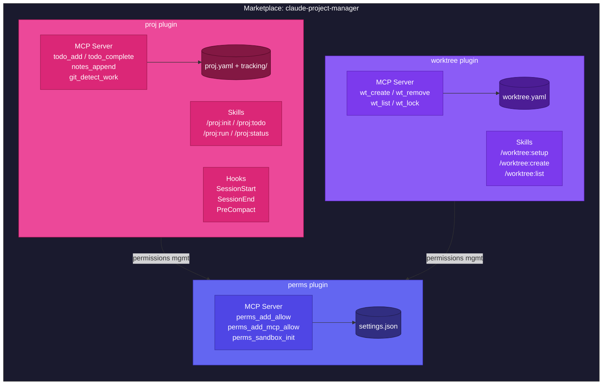
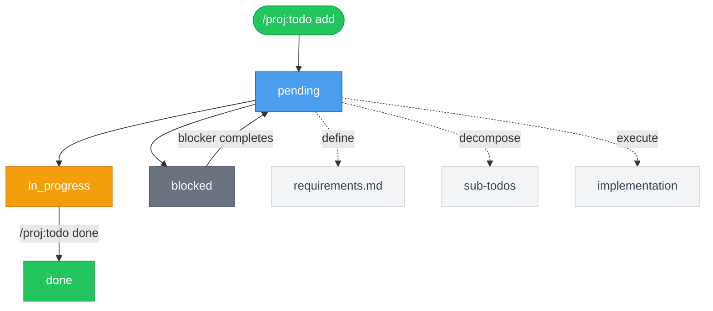
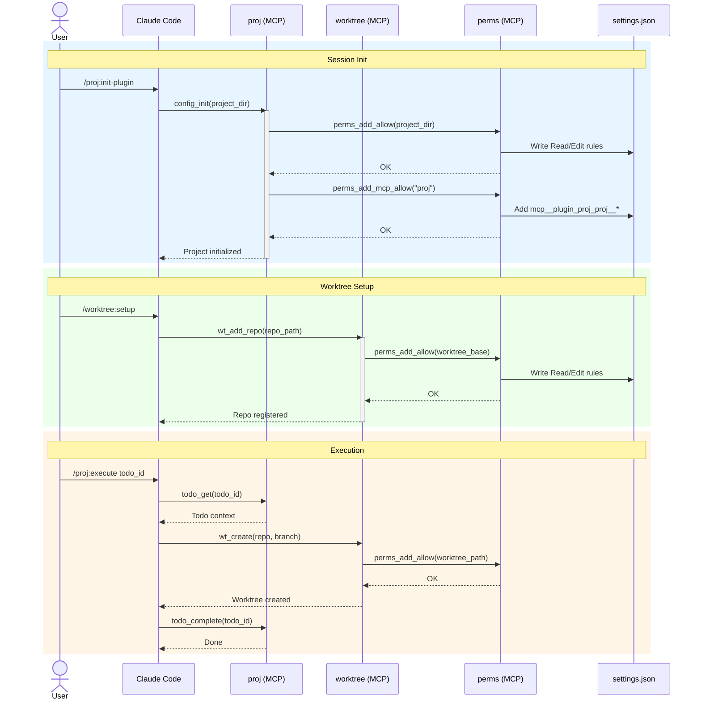
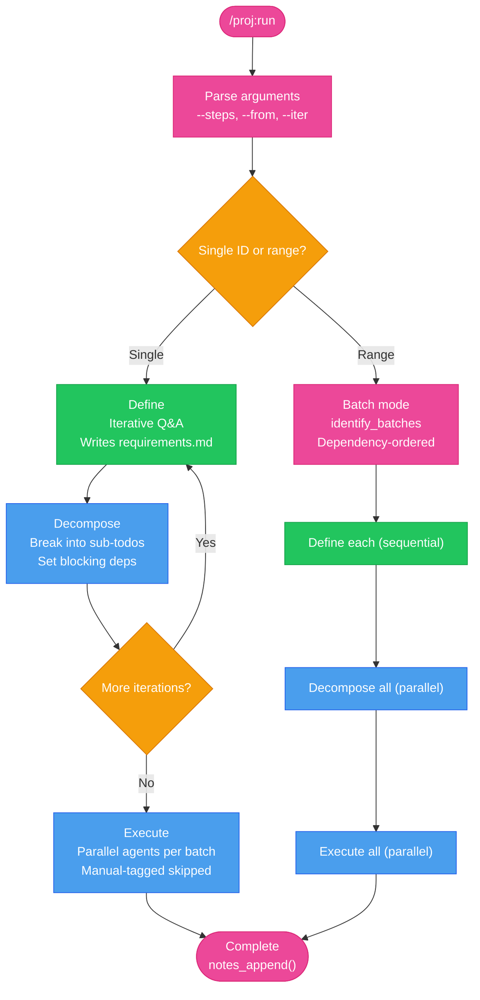

# claude-project-manager

Project management plugins for Claude Code — track todos, manage permissions, and orchestrate git worktrees from inside your conversations.

[](CHANGELOG.md)
[](#contributing)
[](LICENSE)

---

## Table of Contents

- [Overview](#overview)
- [Quick Start](#quick-start)
- [Plugins](#plugins)
  - [perms](#perms)
  - [worktree](#worktree)
  - [proj](#proj)
- [Skill Reference](#skill-reference)
- [Configuration](#configuration)
- [Architecture](#architecture)
- [Contributing](#contributing)
- [License](#license)

---

## Overview

Three focused plugins that work independently or together:

| Plugin | What it does | Type |
|--------|-------------|------|
| **perms** | Auto-manages `settings.json` permissions — directory Read/Edit rules and MCP tool wildcards | MCP server |
| **worktree** | Registry-based git worktree management — create, list, and clean up isolated worktrees | MCP server + 6 skills |
| **proj** | Full project lifecycle — todos with nested dependencies, notes, Todoist/Trello sync, AI-powered workflows | MCP server + 18 skills + hooks |

All three use atomic file writes, pass strict type checking (basedpyright), and have >80% test coverage.

---

## Quick Start

```console
$ # 1. Install plugins
$ /plugin install raulfrk/claude-project-manager:perms
$ /plugin install raulfrk/claude-project-manager:worktree
$ /plugin install raulfrk/claude-project-manager:proj

$ # 2. First-time setup
$ /proj:init-plugin

$ # 3. Create a project
$ /proj:init

$ # 4. Start working
$ /proj:todo add Build something awesome
$ /proj:status
```

---

## Plugins

### perms

MCP-only server (no skills). Provides atomic read/write access to Claude Code's `settings.json` and `settings.local.json`. Used internally by `proj` and `worktree` during setup, and can be called directly.

**MCP Tools:**

| Tool | Description |
|------|-------------|
| `perms_add_allow(path)` | Add Read + Edit rules for a directory |
| `perms_remove_allow(path)` | Remove rules for a directory |
| `perms_list()` | List current allow rules |
| `perms_check(path)` | Check if a path has allow rules |
| `perms_add_mcp_allow(server)` | Add `mcp__<server>__*` wildcard rule |
| `perms_remove_mcp_allow(server)` | Remove MCP wildcard rule |
| `perms_batch_add_mcp_allow(servers)` | Add wildcards for multiple servers atomically |
| `perms_sandbox_init(path?)` | Initialize sandbox mode, migrate existing rules |
| `perms_add_domain(domain)` | Add domain to sandbox network allowlist |
| `perms_remove_domain(domain)` | Remove domain from sandbox allowlist |
| `perms_deny_write(path)` | Add path to sandbox deny-write list |
| `perms_remove_deny_write(path)` | Remove from deny-write list |
| `perms_deny_read(path)` | Add path to sandbox deny-read list |
| `perms_remove_deny_read(path)` | Remove from deny-read list |

All operations are idempotent. Paths use the double-slash prefix for absolute paths (`//home/user/projects/**`). Changes take effect immediately.

---

### worktree

Manages git worktrees from registered base repositories. Register a repo once with a label, then spin up isolated worktrees for branches or parallel work.

**Skills:**

| Skill | Description | Arguments |
|-------|-------------|-----------|
| `/worktree:setup` | Configure the worktree plugin | — |
| `/worktree:add-repo` | Register a base git repository | `[label] [path]` |
| `/worktree:create` | Create a worktree from a registered repo | `[repo-label] [branch]` |
| `/worktree:list` | List all worktrees | `[repo-label]` |
| `/worktree:remove` | Remove a worktree | `[path]` |
| `/worktree:prune` | Clean up stale worktree metadata | `[repo-label]` |

**MCP Tools:** `wt_add_repo`, `wt_remove_repo`, `wt_list_repos`, `wt_create`, `wt_get`, `wt_list`, `wt_remove`, `wt_lock`, `wt_unlock`, `wt_prune`

Config: `~/.claude/worktree.yaml`

---

### proj

The core plugin. Tracks project metadata, todos with nested dependencies and blocking relationships, timestamped notes, and git activity across multiple repositories. Supports bidirectional Todoist and Trello sync.

**Skills by category:**

| Category | Skills |
|----------|--------|
| **Setup** | `init-plugin`, `init`, `quick` |
| **Daily workflow** | `status`, `todo`, `save`, `load`, `switch`, `list-proj`, `sync`, `trello-sync` |
| **Deep work** | `define`, `decompose`, `execute`, `run` |
| **Repositories** | `add-repo`, `remove-repo` |
| **Management** | `archive` |

**Hooks** run automatically at session start, session end, and pre-compact to inject project context.

**Key features:**
- Nested todos with dot-notation IDs (`1`, `1.1`, `1.1.1`) and blocking relationships
- AI-powered workflows: define requirements → decompose into subtasks → execute with parallel agents
- Bidirectional Todoist sync (priority mapping, description sync, ghost detection)
- Trello board sync (cards mapped to root todos)
- Git activity detection and commit-to-todo linking
- Per-project CLAUDE.md context management
- Session notes with timestamped entries

---

## Skill Reference

### proj skills

| Skill | Description | Arguments |
|-------|-------------|-----------|
| `/proj:init-plugin` | First-time setup wizard | — |
| `/proj:init` | Initialize project tracking | `[project-name]` |
| `/proj:quick` | Create project and launch full workflow on first todo | `[project-name]` |
| `/proj:status` | Show project status, todos, git activity | — |
| `/proj:todo` | Manage todos (add/done/list/tree/block/delete) | `[operation] [args]` |
| `/proj:define` | Gather requirements via iterative Q&A | `<todo-id>` |
| `/proj:decompose` | Break todo into sub-todos with dependencies | `<todo-id>` |
| `/proj:execute` | Execute a todo (implement changes) | `<todo-id>` |
| `/proj:run` | Run define → decompose → execute interactively | `<id \| range>` `[--steps <csv>]` `[--from <step>]` `[--iter N]` |
| `/proj:save` | Save session notes and reconcile git | — |
| `/proj:load` | Load project for session (cross-directory) | `[project-name]` |
| `/proj:switch` | Switch active project context | `[project-name]` |
| `/proj:archive` | Archive a completed project | `[project-name]` |
| `/proj:list-proj` | List all tracked projects | — |
| `/proj:sync` | Bidirectional Todoist sync | — |
| `/proj:trello-sync` | Bidirectional Trello sync | — |
| `/proj:add-repo` | Add a directory/repo to the active project | `<path> [--label] [--claudemd]` |
| `/proj:remove-repo` | Remove a directory/repo by label | `<label>` |

### worktree skills

| Skill | Description | Arguments |
|-------|-------------|-----------|
| `/worktree:setup` | Configure worktree plugin | — |
| `/worktree:add-repo` | Register base git repository | `[label] [path]` |
| `/worktree:create` | Create worktree from registered repo | `[repo-label] [branch]` |
| `/worktree:list` | List all worktrees | `[repo-label]` |
| `/worktree:remove` | Remove a worktree | `[path]` |
| `/worktree:prune` | Clean up stale worktree metadata | `[repo-label]` |

---

## Configuration

The `proj` plugin is configured via `~/.claude/proj.yaml`, written during `/proj:init-plugin`.

| Field | Type | Default | Description |
|-------|------|---------|-------------|
| `tracking_dir` | string | `~/projects/tracking` | Root directory for project tracking data |
| `projects_base_dir` | string | — | Base directory for new projects |
| `git_integration` | boolean | `true` | Enable git activity detection |
| `default_priority` | string | `medium` | Default todo priority (`low`/`medium`/`high`) |
| `permissions.auto_grant` | boolean | `true` | Auto-add Read/Edit rules for project dirs |
| `permissions.auto_allow_mcps` | boolean | `true` | Auto-allow plugin MCP tools |
| `todoist.enabled` | boolean | `false` | Enable Todoist sync |
| `todoist.auto_sync` | boolean | `true` | Auto-sync on every proj command |
| `todoist.mcp_server` | string | `claude_ai_Todoist` | MCP server name for Todoist |
| `todoist.root_only` | boolean | `false` | Sync only root-level todos |
| `trello.enabled` | boolean | `false` | Enable Trello sync |
| `trello.mcp_server` | string | `trello` | MCP server name for Trello |
| `trello.default_board_id` | string | — | Trello board ID |
| `trello.on_delete` | string | `archive` | Card handling on todo delete |
| `perms_integration` | boolean | `false` | Whether perms plugin is installed |
| `worktree_integration` | boolean | `false` | Whether worktree plugin is installed |
| `claudemd_management` | boolean | `false` | Enable CLAUDE.md write guard |

---

## Architecture

### System Overview

How each plugin fits into the marketplace.



### Todo Lifecycle



<details>
<summary><strong>Plugin Interaction Sequence</strong></summary>

How the three plugins interact during init and execution.



</details>

<details>
<summary><strong>Full Workflow Lifecycle</strong></summary>

The `run` skill lifecycle: define → decompose → execute.



</details>

<details>
<summary><strong>Todoist/Trello Sync Flow</strong></summary>

Bidirectional sync for Todoist and Trello integrations.

```mermaid
sequenceDiagram
    autonumber
    participant U as User
    participant S as proj Skill
    participant TdM as Todoist MCP
    participant TrM as Trello MCP

    rect rgb(40, 60, 90)
        note right of U: Todoist Sync (/proj:sync)

        note over U,TdM: Push new local todo
        U->>S: /proj:sync
        S->>TdM: add-tasks(title, project_id)
        TdM-->>S: task_id
        S->>S: Store todoist_task_id

        note over U,TdM: Pull completed task
        S->>TdM: fetch-object(task_id)
        TdM-->>S: is_completed=true
        S->>S: Mark local todo done

        note over U,TdM: Title conflict
        S->>S: Compare timestamps
        alt Local newer
            S->>TdM: update-tasks(task_id, title)
        else Remote newer
            S->>S: Update local title
        end
    end

    rect rgb(50, 70, 50)
        note right of U: Trello Sync (/proj:trello-sync)

        U->>S: /proj:trello-sync
        S->>TrM: create_card(name, list)
        TrM-->>S: card_id
        S->>S: Store trello_card_id
    end
```



</details>

<details>
<summary><strong>Session Flow</strong></summary>

What happens automatically via hooks at session boundaries.


</details>

---

## Contributing

**Dev setup:**

```console
$ cd plugins/proj/server && uv sync
$ cd plugins/worktree/server && uv sync
$ cd plugins/perms/server && uv sync
```

**Run tests:**

```console
$ cd plugins/proj/server && uv run pytest -q       # 570 tests, 85% coverage
$ cd plugins/worktree/server && uv run pytest -q    # 58 tests, 83% coverage
$ cd plugins/perms/server && uv run pytest -q       # 124 tests, 92% coverage
```

**Quality tools:** basedpyright (strict), ruff, pytest + pytest-cov + pytest-xdist

**Version bumps** must update together:
- `plugins/<name>/.claude-plugin/plugin.json`
- `plugins/<name>/server/pyproject.toml`
- `.claude-plugin/marketplace.json`

**Skill files** live at `plugins/<name>/skills/<skill-name>/SKILL.md`.

This project is in early development. No PRs are being accepted at this time.

---

## License

MIT
