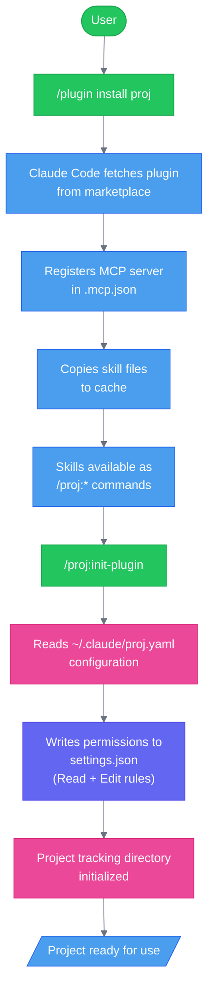
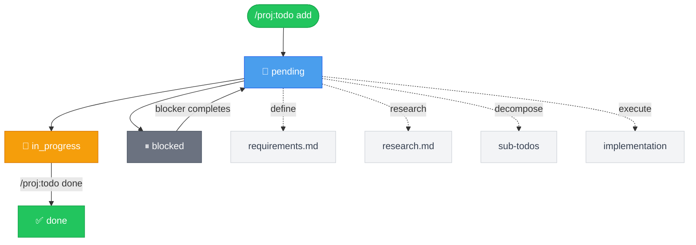
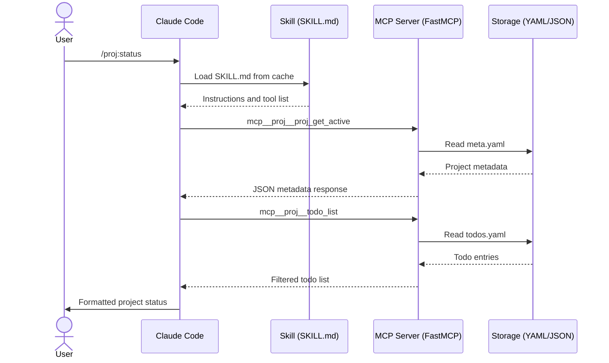
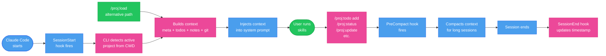

# claude-project-manager

A Claude Code plugin marketplace for project management workflows.

[](CHANGELOG.md)
[](LICENSE)
[](#contributing)

[](https://excalidraw.com/#json=ue4znbuVRXdEwG3C7cuc0,F6Q5l9SK9gxOXnP1qup2bQ)

> Source: [`docs/diagrams/overview.excalidraw`](docs/diagrams/overview.excalidraw)

---

## Overview

`claude-project-manager` is a Claude Code plugin marketplace that extends Claude with project management superpowers. Four focused plugins work independently or together to handle the full lifecycle of software projects — from permissions management through task tracking to AI-powered execution.

**perms** (v0.7.0) — Auto-manages `settings.json` permissions. Grants directory Read/Edit access and adds MCP allow-rule wildcards so Claude can act on your filesystem without manual configuration.

**worktree** (v0.7.0) — Git worktree management. Register base repositories once, then create, list, and remove isolated worktrees on demand — all from within a Claude Code conversation.

**proj** (v0.31.0) — Full project lifecycle management. Tracks todos with nested dependencies, appends timestamped notes, syncs bidirectionally with Todoist and Trello (root todos only), detects git activity, generates reports, and drives AI-powered research and parallel execution of work items.

**claude-helper** (v0.1.0) — Review and quality tooling for Claude Code. Analyses SKILL.md files and subagent definition files, scoring them across ten quality dimensions and producing prioritised improvement reports. Pure-skill plugin — no MCP server required.

---

## Installation

Install each plugin individually via the Claude Code plugin command:

```
/plugin install raulfrk/claude-project-manager:perms
/plugin install raulfrk/claude-project-manager:worktree
/plugin install raulfrk/claude-project-manager:proj
/plugin install raulfrk/claude-project-manager:claude-helper
```

After installing `proj`, run the first-time setup wizard:

```
/proj:init-plugin
```

---

## Quick Start

```
1. /plugin install raulfrk/claude-project-manager:perms
   /plugin install raulfrk/claude-project-manager:worktree
   /plugin install raulfrk/claude-project-manager:proj
   /plugin install raulfrk/claude-project-manager:claude-helper  # optional

2. /proj:init-plugin        # configure tracking dir, Todoist, permissions

3. /proj:init               # create your first project

4. /proj:todo add Build something awesome

5. /proj:status             # see your project
```

---

## Plugins

### perms

The `perms` plugin is an MCP-only server (no skills) that provides atomic read/write access to Claude Code's `settings.json`. It is used internally by `proj` and `worktree` during initialization, and can also be called directly.

**MCP tools:**

| Tool | Description |
|------|-------------|
| `perms_add_allow(path)` | Add `Read` and `Edit` rules for a directory path |
| `perms_remove_allow(path)` | Remove Read/Edit rules for a directory |
| `perms_list()` | List all current allow rules |
| `perms_check(path)` | Check whether a path already has allow rules |
| `perms_add_mcp_allow(server)` | Add an `mcp__<server>__*` wildcard allow rule |
| `perms_remove_mcp_allow(server)` | Remove a wildcard allow rule for an MCP server |
| `perms_batch_add_mcp_allow(servers)` | Add wildcard rules for multiple servers in one atomic write |

Paths written to `settings.json` use the double-slash prefix required for absolute paths (e.g., `//home/raul/projects/**`). Rules take effect immediately without restarting Claude Code.

---

### worktree

The `worktree` plugin manages git worktrees from a set of registered base repositories. Register a repo once with a short label, then spin up isolated worktrees for feature branches or parallel work sessions.

**Skills:**

| Skill | Description |
|-------|-------------|
| `/worktree:setup` | Configure the worktree plugin |
| `/worktree:add-repo` | Register a base git repository with a label |
| `/worktree:create` | Create a new worktree from a registered repo |
| `/worktree:list` | List all worktrees (optionally filtered by repo) |
| `/worktree:remove` | Remove a worktree by path |
| `/worktree:prune` | Clean up stale worktree metadata |

---

### claude-helper

The `claude-helper` plugin provides review and quality tooling for Claude Code skill and agent definition files. It has no MCP server — all review logic is pure Claude reasoning over file content.

**Skills:**

| Skill | Description |
|-------|-------------|
| `/claude-helper:review-skill` | Review a single SKILL.md file — scores all 10 quality dimensions and produces an annotated report |
| `/claude-helper:review-agent` | Review a Claude subagent definition file — same workflow with criteria adapted for agent conventions |
| `/claude-helper:review-all` | Batch-review all SKILL.md files under a directory, spawning parallel agents and sorting results by score |

Each dimension produces a 1–5 score, an impact rating, a finding, and a concrete improvement suggestion. Pass `--include-agents` to `review-all` to also cover agent definition files.

---

### proj

The `proj` plugin is the core of the marketplace. It tracks project metadata, todos with nested dependencies and blocking relationships, timestamped notes, and git activity across multiple repositories. Todos follow a full lifecycle: `pending` → `in_progress` → `done`, with optional `requirements.md` and `research.md` content attached to any item.

**Skills by category:**

- **Setup**: `init-plugin`, `init`, `quick`
- **Daily workflow**: `status`, `todo`, `update`, `sync`, `explore`, `list-proj`, `save`, `trello-sync`, `extract-todos`
- **Deep work**: `define`, `research`, `decompose`, `execute`, `full-workflow`, `prep-workflow`, `quick-workflow`
- **Agents**: `agents-list`, `agents-set`, `agents-remove`, `create-agent`, `agents-create-define`, `agents-create-research`, `agents-create-decompose`, `agents-create-execute`
- **Reports**: `report`
- **Management**: `archive`, `load`, `switch`
- **Maintenance**: `migrate-ids`, `migrate-to-proj`, `perms-sync`

Hooks run automatically at session start, session end, and pre-compact to inject project context without any manual steps.

---

## Skill Reference

### proj skills

| Skill | Plugin | Description | Arguments |
|-------|--------|-------------|-----------|
| `/proj:init-plugin` | proj | First-time setup wizard | none |
| `/proj:init` | proj | Initialize project tracking | `[project-name]` |
| `/proj:quick` | proj | Create a new project and immediately launch full-workflow on the first todo | `[project-name]` |
| `/proj:status` | proj | Show project status, todos, git activity | none |
| `/proj:todo` | proj | Manage todos (add/done/list/tree/block/delete) | `[operation] [args]` |
| `/proj:update` | proj | Record progress, reconcile git, append notes | `[note text]` |
| `/proj:execute` | proj | Execute todo(s) with parallel agents | `[id \| range]` e.g. `1` or `2-4` |
| `/proj:report` | proj | Generate comprehensive project report | none |
| `/proj:archive` | proj | Archive completed project | `[project-name]` |
| `/proj:switch` | proj | Switch active project context | `[project-name]` |
| `/proj:load` | proj | Load project for session (cross-directory) | `[project-name]` |
| `/proj:sync` | proj | Bidirectional Todoist sync | none |
| `/proj:define` | proj | Gather requirements via iterative Q&A | `<todo-id>` |
| `/proj:research` | proj | Research implementation approach | `<todo-id>` or `1,2,3` |
| `/proj:decompose` | proj | Break todo into sub-todos | `<todo-id>` |
| `/proj:migrate-ids` | proj | Migrate todo IDs to numeric format | `[--dry-run]` |
| `/proj:migrate-to-proj` | proj | Migrate existing project directory into proj tracking | `[project-name]` |
| `/proj:perms-sync` | proj | Check settings.json matches project config | none |
| `/proj:explore` | proj | Explore and map a project's codebase, update CLAUDE.md | none |
| `/proj:list-proj` | proj | List all non-archived tracked projects | none |
| `/proj:full-workflow` | proj | Run define → research → decompose → execute interactively | `<id | range | list> [--iter N | --iter-as-needed[=N]] [--steps <csv> | --from <step>] [--no-interactive]` |
| `/proj:prep-workflow` | proj | Run define → research → decompose interactively | `<id | range | list> [--iter N | --iter-as-needed[=N]] [--steps <csv> | --from <step>] [--no-interactive]` |
| `/proj:quick-workflow` | proj | Create a new todo and immediately run full-workflow on it | `<description> [--steps <csv>] [--from <step>] [--iter N] [--iter-as-needed[=N]]` |
| `/proj:save` | proj | Save session notes to project — appends to NOTES.md and writes a dated session file | none |
| `/proj:trello-sync` | proj | Bidirectional Trello sync for root todos | — |
| `/proj:extract-todos` | proj | Scan repo source files for TODO/FIXME comments and import as project todos | `[--dry-run]` |
| `/proj:agents-list` | proj | List all agent overrides for the active project | none |
| `/proj:agents-set` | proj | Set an agent override for a workflow step (define/research/decompose/execute) | `<step> <agent-name>` |
| `/proj:agents-remove` | proj | Remove an agent override for a step | `<step>` |
| `/proj:create-agent` | proj | Create a custom Claude Code agent file for a project workflow step | `[--global] [step] [agent-name]` |
| `/proj:agents-create-define` | proj | Create a custom agent file for the define (requirements) step | `[--global] [agent-name]` |
| `/proj:agents-create-research` | proj | Create a custom agent file for the research step | `[--global] [agent-name]` |
| `/proj:agents-create-decompose` | proj | Create a custom agent file for the decompose step | `[--global] [agent-name]` |
| `/proj:agents-create-execute` | proj | Create a custom agent file for the execute step | `[--global] [agent-name]` |

### claude-helper skills

| Skill | Plugin | Description | Arguments |
|-------|--------|-------------|-----------|
| `/claude-helper:review-skill` | claude-helper | Review a single SKILL.md file across 10 quality dimensions | `<path-to-SKILL.md>` |
| `/claude-helper:review-agent` | claude-helper | Review a Claude subagent definition file | `<path-to-agent-file>` |
| `/claude-helper:review-all` | claude-helper | Batch-review all SKILL.md files under a directory (parallel agents, sorted by score) | `<directory> [--include-agents]` |

### worktree skills

| Skill | Plugin | Description | Arguments |
|-------|--------|-------------|-----------|
| `/worktree:setup` | worktree | Configure worktree plugin | none |
| `/worktree:add-repo` | worktree | Register base git repository | `[label] [path]` |
| `/worktree:create` | worktree | Create worktree from registered repo | `[repo-label] [branch]` |
| `/worktree:list` | worktree | List all worktrees | `[repo-label]` |
| `/worktree:remove` | worktree | Remove a worktree | `[path]` |
| `/worktree:prune` | worktree | Clean up stale worktree metadata | `[repo-label]` |

---

## Configuration

The `proj` plugin is configured via `~/.claude/proj.yaml`, written during `/proj:init-plugin`.

| Field | Type | Default | Description |
|-------|------|---------|-------------|
| `tracking_dir` | string | `~/projects/tracking` | Root directory for all project tracking data |
| `projects_base_dir` | string | `~/projects` | Base directory used when initializing new projects |
| `git_integration` | boolean | `true` | Enable git activity detection |
| `default_priority` | string | `medium` | Default todo priority (`low`/`medium`/`high`) |
| `permissions.auto_grant` | boolean | `true` | Auto-add Read/Edit rules for project directories |
| `permissions.auto_allow_mcps` | boolean | `true` | Auto-allow plugin MCP tools in `settings.json` |
| `todoist.enabled` | boolean | `false` | Enable Todoist bidirectional sync |
| `todoist.auto_sync` | boolean | `true` | Auto-sync todos on every proj command |
| `todoist.mcp_server` | string | `claude_ai_Todoist` | MCP server name for Todoist integration |
| `todoist.root_only` | boolean | `false` | Sync only root-level todos (no subtodos) to Todoist |
| `trello.enabled` | boolean | `false` | Enable Trello bidirectional sync |
| `trello.mcp_server` | string | `trello` | MCP server name for Trello integration |
| `trello.default_board_id` | string | — | Trello board ID to sync root todos to |
| `trello.list_mappings.created` | string | — | Trello list name for pending/in-progress todos |
| `trello.list_mappings.done` | string | — | Trello list name for completed todos |
| `trello.on_delete` | string | `archive` | What to do with Trello cards when todo is deleted (`archive` or `delete`) |
| `perms_integration` | boolean | `false` | Whether the `perms` plugin is installed |
| `worktree_integration` | boolean | `false` | Whether the `worktree` plugin is installed |

**Example `~/.claude/proj.yaml`:**

```yaml
version: 1
tracking_dir: ~/projects/tracking
git_integration: true
default_priority: medium
permissions:
  auto_grant: true
  auto_allow_mcps: true
sync:
  todoist:
    enabled: true
    auto_sync: true
    mcp_server: claude_ai_Todoist
    root_only: false
  trello:
    enabled: false
    mcp_server: trello
    default_board_id: ""
    list_mappings:
      created: "In Progress"
      done: "Done"
    on_delete: archive
perms_integration: true
worktree_integration: true
```

---

## Workflow Diagrams

How each plugin is installed and wired together during first-time setup.



The states a todo passes through from creation to completion, including requirements, research, and blocking relationships.



How a skill invocation travels from the `/proj:<name>` command through the MCP server to tracking data.



What happens automatically at session start, during a session, and at session end via hooks.



---

## Contributing

**Dev setup:**

```bash
cd plugins/proj/server
uv sync
```

**Run tests:**

```bash
uv run pytest tests/ -q
```

**Coverage threshold:** 72%

**Version bumps** must update both files together:
- `plugins/<name>/.claude-plugin/plugin.json`
- `.claude-plugin/marketplace.json`

**Skill files** live at `plugins/<name>/skills/<skill-name>/SKILL.md`.

This project is in early development. No PRs are being accepted at this time.
