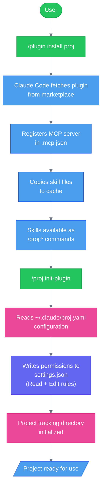
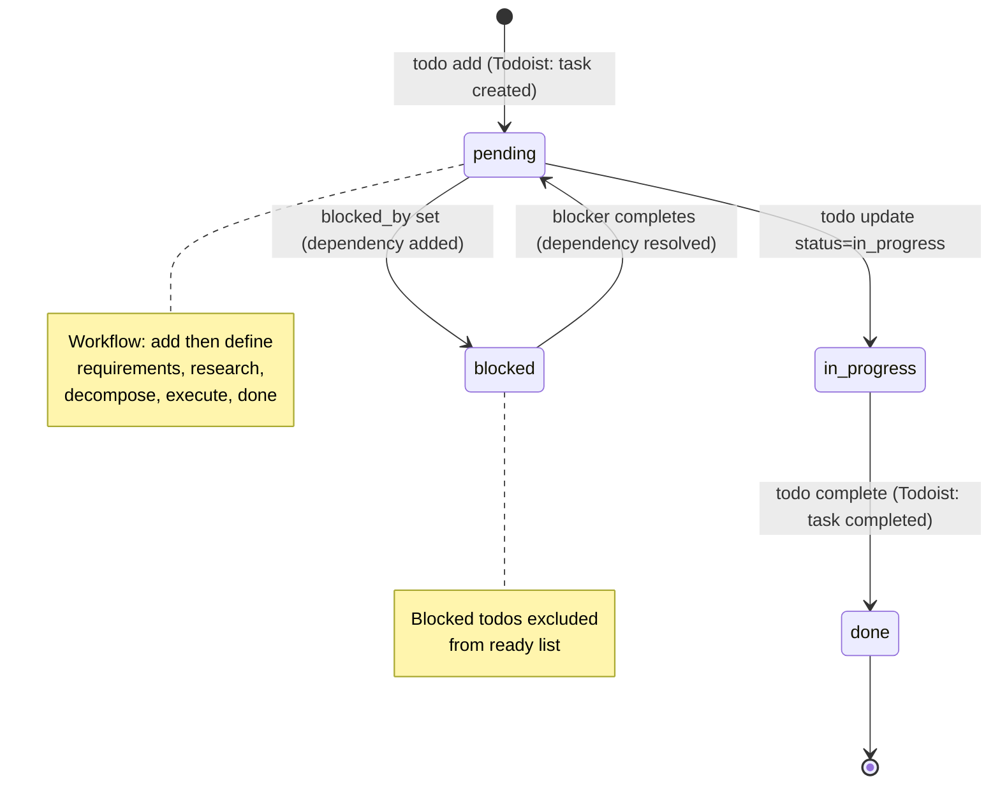
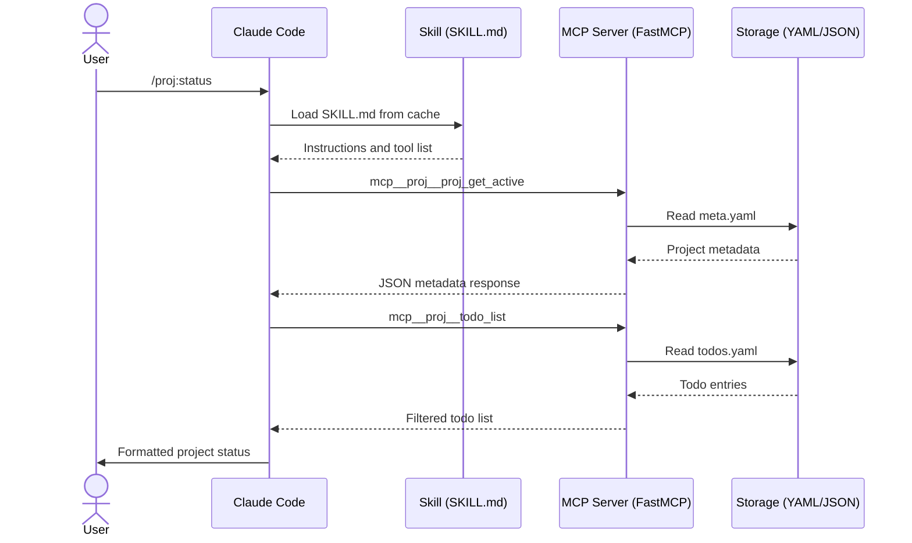
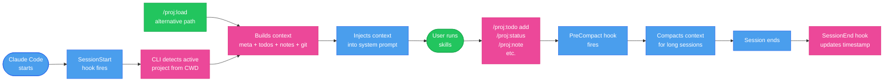
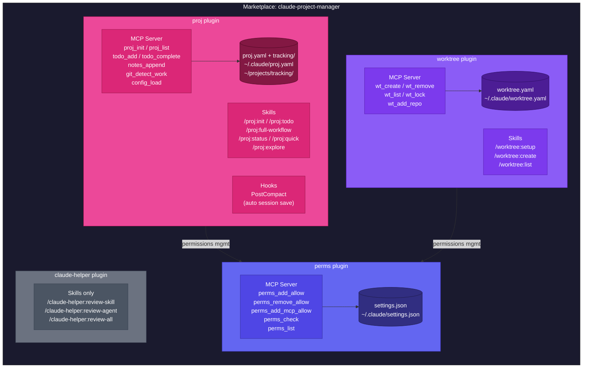
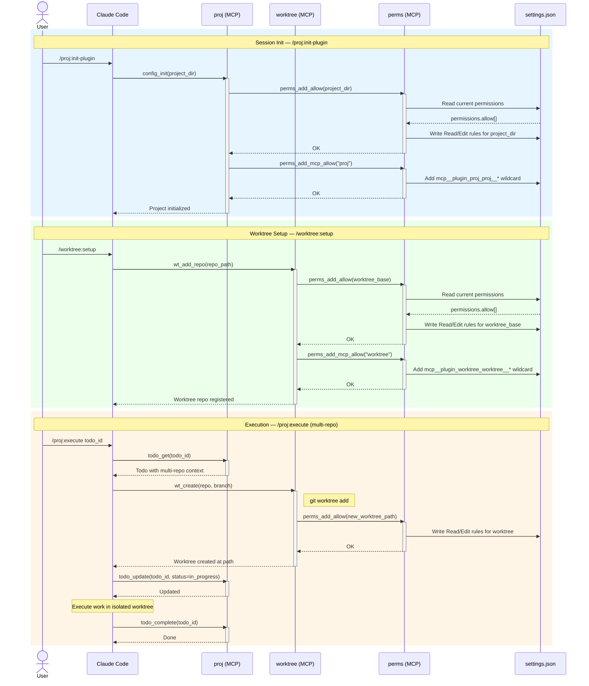

## Plugin Installation Flow

## Todo Lifecycle

## Skill Invocation Architecture

## Project Session Flow

## Architecture Overview

## Full Workflow Lifecycle

```mermaid
flowchart TD
    %% Color definitions
    classDef user fill:#22C55E,stroke:#16A34A,color:#fff
    classDef claude fill:#4A9EED,stroke:#2563EB,color:#fff
    classDef proj fill:#EC4899,stroke:#DB2777,color:#fff
    classDef decision fill:#F59E0B,stroke:#D97706,color:#fff
    classDef skip fill:#94A3B8,stroke:#64748B,color:#fff

    %% Entry
    START(["/proj:full-workflow <id>"]):::proj
    START --> PARSE

    %% Step 1: Parse & Validate
    PARSE["1. Parse Arguments\n--steps, --from, --iter, --iter-as-needed\n--no-interactive"]:::proj
    PARSE --> MODE_CHECK{Input mode?}:::decision

    MODE_CHECK -->|"Single ID"| VALIDATE_TODO
    MODE_CHECK -->|"Range / Comma list"| RANGE_PATH

    VALIDATE_TODO["Validate todo exists\ntodo_get(id)"]:::proj
    VALIDATE_TODO --> LOAD_STEPS

    %% Step 2: Load Workflow Steps
    LOAD_STEPS["2. Load Step List\nfull-workflow.yaml\nDefault: define -> research -> decompose -> execute"]:::proj
    LOAD_STEPS --> APPLY_FLAGS

    APPLY_FLAGS{"--steps or\n--from given?"}:::decision
    APPLY_FLAGS -->|"--steps csv"| FILTER_STEPS["Filter & reorder\nto requested steps"]:::proj
    APPLY_FLAGS -->|"--from step"| SLICE_STEPS["Slice from step\nto end"]:::proj
    APPLY_FLAGS -->|"Neither"| FULL_STEPS["Use all 4 steps"]:::proj

    FILTER_STEPS --> SPLIT
    SLICE_STEPS --> SPLIT
    FULL_STEPS --> SPLIT

    %% Step 3: Split prep vs execute
    SPLIT["3. Split Steps\nprep_steps = steps minus execute\nhas_execute = execute in list?"]:::proj
    SPLIT --> ITER_LOOP

    %% Step 4: Iteration Loop
    ITER_LOOP["4. Iteration Loop\ni = 1 to N"]:::proj
    ITER_LOOP --> REFRESH_TREE

    REFRESH_TREE["4a. Refresh descendant list\ntodo_tree(id) -> flatten depth-first"]:::proj
    REFRESH_TREE --> PREP_STEPS

    %% Prep Steps Detail
    PREP_STEPS{"Next prep step?"}:::decision

    PREP_STEPS -->|"define"| DEFINE
    PREP_STEPS -->|"research"| RESEARCH
    PREP_STEPS -->|"decompose"| DECOMPOSE
    PREP_STEPS -->|"All prep done"| CONVERGENCE_CHECK

    %% Define
    DEFINE["Step: Define\nSequential & Interactive\nIterative Q&A with user\nWrites requirements.md"]:::user
    DEFINE --> PREP_STEPS

    %% Research
    RESEARCH["Step: Research\nParallel Task agents (1 per batch)\nCodebase exploration\nWrites research.md"]:::claude
    RESEARCH --> PREP_STEPS

    %% Decompose
    DECOMPOSE["Step: Decompose\nParallel Task agents (1 per batch)\nBreaks into sub-todos with deps\nRefreshes descendant list"]:::claude
    DECOMPOSE --> PREP_STEPS

    %% Convergence Check (between iterations)
    CONVERGENCE_CHECK{"4c. Last iteration?\n(i == N)"}:::decision
    CONVERGENCE_CHECK -->|"Yes"| EXECUTE_GATE
    CONVERGENCE_CHECK -->|"No"| ITER_MODE_CHECK

    ITER_MODE_CHECK{"--iter-as-needed?"}:::decision
    ITER_MODE_CHECK -->|"Yes"| ASSESS["assess_convergence(id)\nCheck define + research + decompose\nfor parent & all descendants"]:::proj
    ITER_MODE_CHECK -->|"No (fixed --iter)"| ITER_PROMPT

    ASSESS --> CONVERGED_CHECK{Converged?}:::decision

    CONVERGED_CHECK -->|"Overall converged"| CONVERGED_PROMPT
    CONVERGED_CHECK -->|"Not converged"| NOT_CONVERGED_PROMPT

    CONVERGED_PROMPT["Recommend stop\nShow 4 options:\n1. Proceed to execute\n2. Continue iteration\n3. Edit\n4. Stop"]:::user
    CONVERGED_PROMPT -->|"Proceed"| EXECUTE_GATE
    CONVERGED_PROMPT -->|"Continue"| ITER_LOOP
    CONVERGED_PROMPT -->|"Edit"| EDIT_ITER["Apply edits\nRe-run or update"]:::user
    CONVERGED_PROMPT -->|"Stop"| WORKFLOW_END
    EDIT_ITER --> CONVERGED_PROMPT

    NOT_CONVERGED_PROMPT["Recommend another iteration\nShow 3 options:\n1. Continue\n2. Edit\n3. Stop"]:::user
    NOT_CONVERGED_PROMPT -->|"Continue"| ITER_LOOP
    NOT_CONVERGED_PROMPT -->|"Edit"| EDIT_ITER2["Apply edits\nRe-run or update"]:::user
    NOT_CONVERGED_PROMPT -->|"Stop"| WORKFLOW_END
    EDIT_ITER2 --> NOT_CONVERGED_PROMPT

    ITER_PROMPT["Iteration prompt\n(3 options: continue/edit/stop)"]:::user
    ITER_PROMPT -->|"Continue"| ITER_LOOP
    ITER_PROMPT -->|"Stop"| WORKFLOW_END

    %% --no-interactive auto-progression
    subgraph NO_INTERACTIVE ["--no-interactive auto-progression"]
        direction TB
        NI_CONVERGED["Auto-proceed to execute"]:::skip
        NI_NOT_CONVERGED["Auto-continue next iteration"]:::skip
    end

    %% Step 5: Execute
    EXECUTE_GATE{"5. has_execute\nAND has_children?"}:::decision

    EXECUTE_GATE -->|"No children"| MANUAL_CHECK
    EXECUTE_GATE -->|"Children converged"| EXECUTE_ALL
    EXECUTE_GATE -->|"Children NOT converged\n(edge-case --steps)"| PARENT_EXEC_THEN_CHILDREN
    EXECUTE_GATE -->|"No execute step"| WORKFLOW_END

    %% Manual tag guard
    MANUAL_CHECK{"todo_check_executable\nManual tag?"}:::decision
    MANUAL_CHECK -->|"manual tagged"| MANUAL_STOP["Stop: manual tag guard\nSkip execute\nUser must execute manually"]:::skip
    MANUAL_CHECK -->|"Executable"| PARENT_EXEC

    PARENT_EXEC["5i. Parent Execute\nRead execute/SKILL.md\nImplement changes\ntodo_complete(id)"]:::claude
    PARENT_EXEC --> WORKFLOW_END

    %% Execute All path
    EXECUTE_ALL["5ii. Execute All (parent + children)\nidentify_batches for dependency order"]:::proj
    EXECUTE_ALL --> BATCH_EXEC

    BATCH_EXEC["For each batch:\nParallel Task agents\nCheck manual tag -> skip if manual\nExecute & complete each todo"]:::claude
    BATCH_EXEC --> AUTO_COMPLETE

    AUTO_COMPLETE{"All children\nexecuted?"}:::decision
    AUTO_COMPLETE -->|"0 manual-skipped"| AUTO_DONE["Auto-complete parent\ntodo_complete(parent_id)"]:::proj
    AUTO_COMPLETE -->|"Some manual-skipped"| NO_AUTO["Parent NOT auto-completed\nManual todos remain"]:::skip

    AUTO_DONE --> WORKFLOW_END
    NO_AUTO --> WORKFLOW_END

    %% Children workflow (edge-case)
    PARENT_EXEC_THEN_CHILDREN --> CHILDREN_WORKFLOW

    CHILDREN_WORKFLOW["6. Children Workflow (edge-case fallback)\nDefine each child (sequential, interactive)\nResearch all (parallel agents)\nDecompose each (sequential confirm)\nExecute all (parallel agents)"]:::claude
    CHILDREN_WORKFLOW --> WORKFLOW_END

    %% Range/batch path
    RANGE_PATH["Range/Batch Path\nAll steps run autonomously\nNo interactive prompts"]:::proj
    RANGE_PATH --> RANGE_BATCHES["identify_batches\nDependency-ordered batches"]:::proj
    RANGE_BATCHES --> RANGE_DEFINE

    RANGE_DEFINE{"define in steps\nAND interactive?"}:::decision
    RANGE_DEFINE -->|"Yes"| RANGE_DEFINE_SEQ["Phase A: Define\nSequential, interactive\nQ&A per todo"]:::user
    RANGE_DEFINE -->|"No"| RANGE_AGENTS

    RANGE_DEFINE_SEQ --> RANGE_AGENTS
    RANGE_AGENTS["Phase B: Remaining prep steps\nParallel agents per batch\n1 agent per todo"]:::claude
    RANGE_AGENTS --> RANGE_CONVERGE

    RANGE_CONVERGE{"--iter-as-needed\nConverged?"}:::decision
    RANGE_CONVERGE -->|"All converged / max iter"| RANGE_EXECUTE
    RANGE_CONVERGE -->|"Not converged"| RANGE_BATCHES

    RANGE_EXECUTE["Phase C: Execute\nParallel agents per batch\nManual-tagged todos skipped"]:::claude
    RANGE_EXECUTE --> RANGE_SUMMARY["Aggregated Summary\nPer-batch breakdown\nnotes_append()"]:::proj
    RANGE_SUMMARY --> WORKFLOW_END

    %% End
    WORKFLOW_END(["7. Workflow Complete\nSteps completed summary\nnotes_append()"]):::proj
```

## Plugin Interaction

## Todoist/Trello Sync Flow

```mermaid
sequenceDiagram
    autonumber
    participant U as User
    participant S as proj Skill
    participant TdM as Todoist MCP
    participant TdS as Todoist Service
    participant TrM as Trello MCP
    participant TrS as Trello Service

    note over S: Sync happens at skill level,<br/>NOT in MCP server.<br/>root_only config limits scope<br/>to root todos only.

    rect rgb(40, 60, 90)
        note right of U: Todoist Sync (/proj:sync)

        note over U,TdS: 1. Local todo created -- push to Todoist
        U->>S: /proj:sync
        S->>S: Load todos (root_only filter)
        S->>TdM: add-tasks(title, project_id)
        TdM->>TdS: POST /tasks
        TdS-->>TdM: task_id
        TdM-->>S: task_id
        S->>S: Store todoist_task_id on local todo

        note over U,TdS: 2. Todoist task completed -- pull to local
        U->>S: /proj:sync
        S->>TdM: fetch-object(task_id)
        TdM->>TdS: GET /tasks/{id}
        TdS-->>TdM: task (is_completed=true)
        TdM-->>S: completed task
        S->>S: Mark local todo done

        note over U,TdS: 3. Title conflict resolution
        U->>S: /proj:sync
        S->>TdM: fetch-object(task_id)
        TdM-->>S: remote title + updated_at
        S->>S: Compare timestamps
        alt Local is newer
            S->>TdM: update-tasks(task_id, local title)
            TdM->>TdS: POST /tasks/{id}
        else Remote is newer
            S->>S: Update local todo title from remote
        end

        note over U,TdS: 4. Ghost detection -- archived local match
        U->>S: /proj:sync
        S->>S: Detect archived todo with todoist_task_id
        S->>TdM: complete-tasks(task_id)
        TdM->>TdS: POST /tasks/{id}/close
        TdS-->>TdM: 204 OK
    end

    rect rgb(50, 70, 50)
        note right of U: Trello Sync (/proj:trello-sync)

        note over U,TrS: 1. Root todo created -- push card
        U->>S: /proj:trello-sync
        S->>S: Load todos (root_only filter)
        S->>TrM: create_card(name, list="created")
        TrM->>TrS: POST /cards
        TrS-->>TrM: card_id
        TrM-->>S: card_id
        S->>S: Store trello_card_id on local todo

        note over U,TrS: 2. Todo completed -- move card
        U->>S: /proj:trello-sync
        S->>S: Detect completed todo with trello_card_id
        S->>TrM: update_card(card_id, list="done")
        TrM->>TrS: PUT /cards/{id}
        TrS-->>TrM: updated card
        TrM-->>S: OK

        note over U,TrS: 3. Todo deleted -- on_delete config
        U->>S: /proj:trello-sync
        S->>S: Detect deleted todo with trello_card_id
        alt on_delete = "archive"
            S->>TrM: archive_card(card_id)
            TrM->>TrS: PUT /cards/{id} closed=true
        else on_delete = "delete"
            S->>TrM: delete_card(card_id)
            TrM->>TrS: DELETE /cards/{id}
        end
        TrS-->>TrM: OK
        TrM-->>S: OK
    end
```

