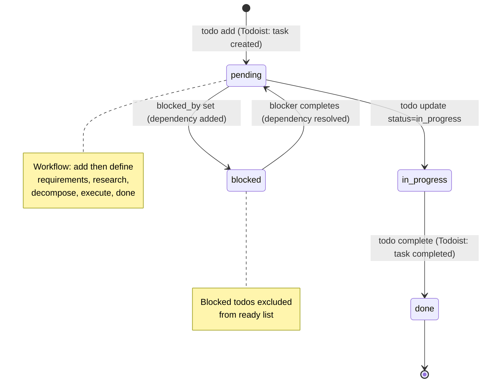
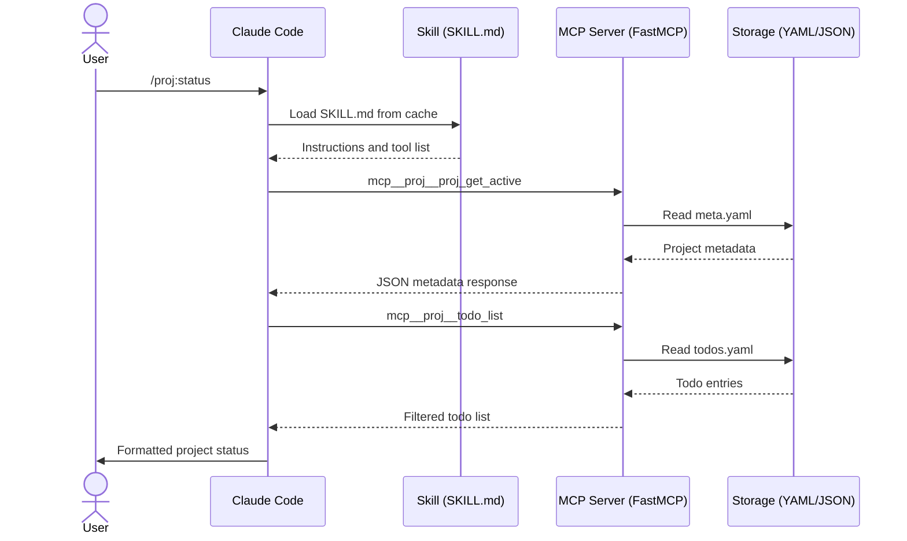

## Plugin Installation Flow

```mermaid
%%{init: {'theme': 'base', 'themeVariables': {'primaryColor': '#EC4899', 'primaryTextColor': '#fff', 'primaryBorderColor': '#DB2777', 'lineColor': '#6B7280', 'secondaryColor': '#6366F1', 'tertiaryColor': '#8B5CF6'}}}%%
flowchart TD
    U([User]):::user
    A["/plugin install proj"]:::user
    B["Claude Code fetches plugin\nfrom marketplace"]:::claude
    C["Registers MCP server\nin .mcp.json"]:::claude
    D["Copies skill files\nto cache"]:::claude
    E["Skills available as\n/proj:* commands"]:::claude
    F["/proj:init-plugin"]:::user
    G["Reads ~/.claude/proj.yaml\nconfiguration"]:::proj
    H["Writes permissions to\nsettings.json\n(Read + Edit rules)"]:::perms
    I["Project tracking directory\ninitialized"]:::proj
    J[/"Project ready for use"/]:::claude

    U --> A
    A --> B
    B --> C
    C --> D
    D --> E
    E --> F
    F --> G
    G --> H
    H --> I
    I --> J

    classDef user fill:#22C55E,stroke:#16A34A,color:#fff
    classDef claude fill:#4A9EED,stroke:#2563EB,color:#fff
    classDef proj fill:#EC4899,stroke:#DB2777,color:#fff
    classDef perms fill:#6366F1,stroke:#4F46E5,color:#fff
    classDef worktree fill:#8B5CF6,stroke:#7C3AED,color:#fff
```

## Todo Lifecycle

```mermaid
stateDiagram-v2
    [*] --> pending : todo add (Todoist: task created)
    pending --> in_progress : todo update status=in_progress
    pending --> blocked : blocked_by set (dependency added)
    blocked --> pending : blocker completes (dependency resolved)
    in_progress --> done : todo complete (Todoist: task completed)
    done --> [*]

    note right of pending
        Workflow: add then define
        requirements, research,
        decompose, execute, done
    end note

    note right of blocked
        Blocked todos excluded
        from ready list
    end note
```

## Skill Invocation Architecture

```mermaid
sequenceDiagram
    actor User
    participant CC as Claude Code
    participant SK as Skill (SKILL.md)
    participant MCP as MCP Server (FastMCP)
    participant ST as Storage (YAML/JSON)

    User->>CC: /proj:status
    CC->>SK: Load SKILL.md from cache
    SK-->>CC: Instructions and tool list
    CC->>MCP: mcp__proj__proj_get_active
    MCP->>ST: Read meta.yaml
    ST-->>MCP: Project metadata
    MCP-->>CC: JSON metadata response
    CC->>MCP: mcp__proj__todo_list
    MCP->>ST: Read todos.yaml
    ST-->>MCP: Todo entries
    MCP-->>CC: Filtered todo list
    CC->>User: Formatted project status
```

## Project Session Flow

```mermaid
flowchart LR
    A([Claude Code\nstarts]):::claude
    B["SessionStart\nhook fires"]:::claude
    C["CLI detects active\nproject from CWD"]:::proj
    D["/proj:load\nalternative path"]:::user
    E["Builds context\nmeta + todos + notes + git"]:::proj
    F["Injects context\ninto system prompt"]:::claude
    G([User runs\nskills]):::user
    H["/proj:todo add\n/proj:status\n/proj:note\netc."]:::proj
    I["PreCompact hook\nfires"]:::claude
    J["Compacts context\nfor long sessions"]:::claude
    K["Session ends"]:::claude
    L["SessionEnd hook\nupdates timestamp"]:::proj

    A --> B
    B --> C
    D --> E
    C --> E
    E --> F
    F --> G
    G --> H
    H --> I
    I --> J
    J --> K
    K --> L

    classDef user fill:#22C55E,stroke:#16A34A,color:#fff
    classDef claude fill:#4A9EED,stroke:#2563EB,color:#fff
    classDef proj fill:#EC4899,stroke:#DB2777,color:#fff
```
