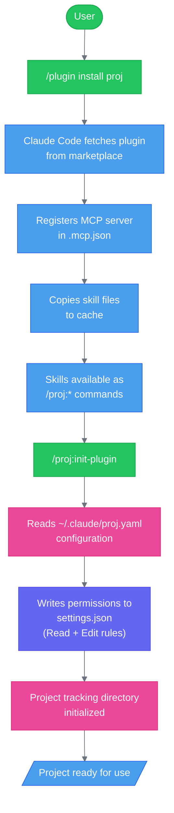
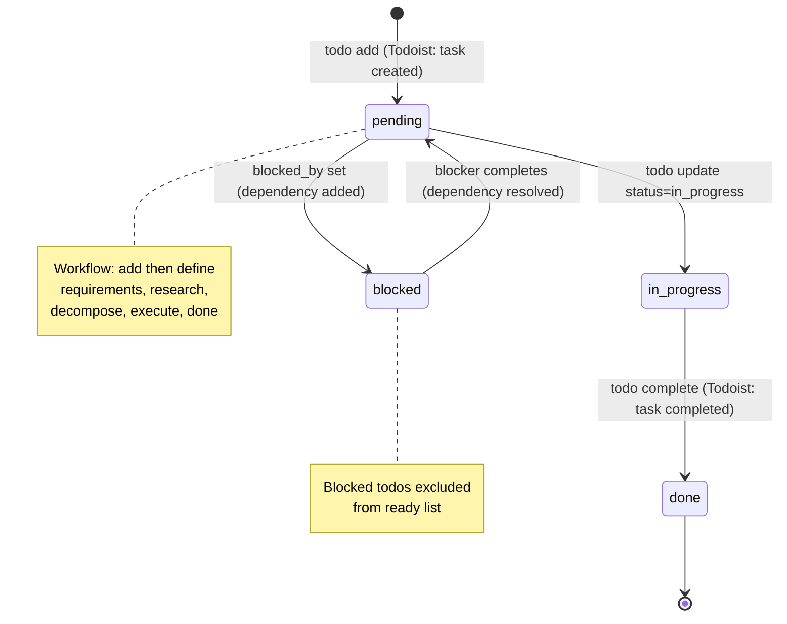
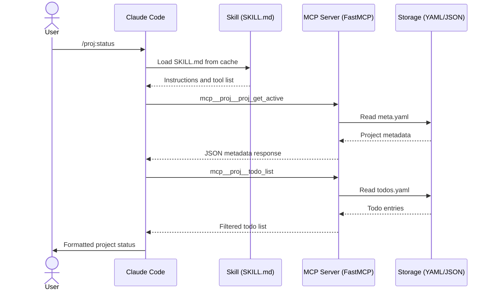
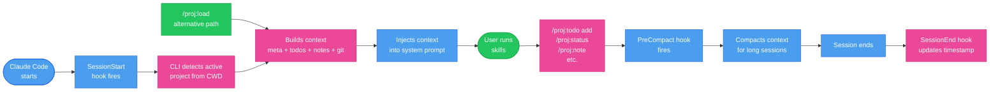
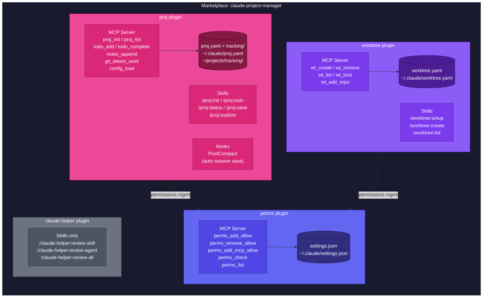
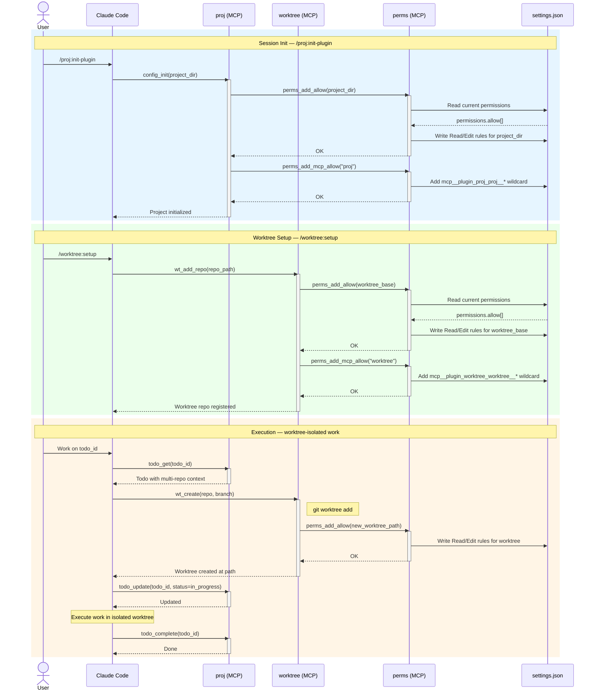
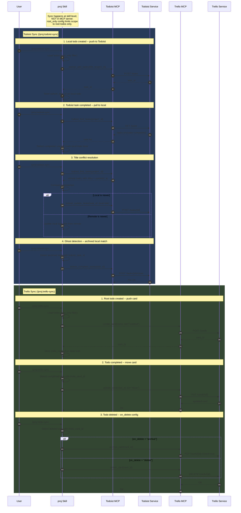

## Plugin Installation Flow

```mermaid
%%{init: {'theme': 'base', 'themeVariables': {'primaryColor': '#EC4899', 'primaryTextColor': '#fff', 'primaryBorderColor': '#DB2777', 'lineColor': '#6B7280', 'secondaryColor': '#6366F1', 'tertiaryColor': '#8B5CF6'}}}%%
flowchart TD
    U([User]):::user
    A["/plugin install proj"]:::user
    B["Claude Code fetches plugin\nfrom marketplace"]:::claude
    C["Registers MCP server\nin .mcp.json"]:::claude
    D["Copies skill files\nto cache"]:::claude
    E["Skills available as\n/proj:* commands"]:::claude
    F["/proj:init-plugin"]:::user
    G["Reads ~/.claude/proj.yaml\nconfiguration"]:::proj
    H["Writes permissions to\nsettings.json\n(Read + Edit rules)"]:::perms
    I["Project tracking directory\ninitialized"]:::proj
    J[/"Project ready for use"/]:::claude

    U --> A
    A --> B
    B --> C
    C --> D
    D --> E
    E --> F
    F --> G
    G --> H
    H --> I
    I --> J

    classDef user fill:#22C55E,stroke:#16A34A,color:#fff
    classDef claude fill:#4A9EED,stroke:#2563EB,color:#fff
    classDef proj fill:#EC4899,stroke:#DB2777,color:#fff
    classDef perms fill:#6366F1,stroke:#4F46E5,color:#fff
    classDef worktree fill:#8B5CF6,stroke:#7C3AED,color:#fff
```

## Todo Lifecycle

```mermaid
stateDiagram-v2
    [*] --> pending : todo add (Todoist: task created)
    pending --> in_progress : todo update status=in_progress
    pending --> blocked : blocked_by set (dependency added)
    blocked --> pending : blocker completes (dependency resolved)
    in_progress --> done : todo complete (Todoist: task completed)
    done --> [*]

    note right of pending
        Workflow: add then define
        requirements, research,
        decompose, execute, done
    end note

    note right of blocked
        Blocked todos excluded
        from ready list
    end note
```

## Skill Invocation Architecture

```mermaid
sequenceDiagram
    actor User
    participant CC as Claude Code
    participant SK as Skill (SKILL.md)
    participant MCP as MCP Server (FastMCP)
    participant ST as Storage (YAML/JSON)

    User->>CC: /proj:status
    CC->>SK: Load SKILL.md from cache
    SK-->>CC: Instructions and tool list
    CC->>MCP: mcp__proj__proj_get_active
    MCP->>ST: Read meta.yaml
    ST-->>MCP: Project metadata
    MCP-->>CC: JSON metadata response
    CC->>MCP: mcp__proj__todo_list
    MCP->>ST: Read todos.yaml
    ST-->>MCP: Todo entries
    MCP-->>CC: Filtered todo list
    CC->>User: Formatted project status
```

## Project Session Flow

```mermaid
flowchart LR
    A([Claude Code\nstarts]):::claude
    B["SessionStart\nhook fires"]:::claude
    C["CLI detects active\nproject from CWD"]:::proj
    D["/proj:load\nalternative path"]:::user
    E["Builds context\nmeta + todos + notes + git"]:::proj
    F["Injects context\ninto system prompt"]:::claude
    G([User runs\nskills]):::user
    H["/proj:todo add\n/proj:status\n/proj:note\netc."]:::proj
    I["PreCompact hook\nfires"]:::claude
    J["Compacts context\nfor long sessions"]:::claude
    K["Session ends"]:::claude
    L["SessionEnd hook\nupdates timestamp"]:::proj

    A --> B
    B --> C
    D --> E
    C --> E
    E --> F
    F --> G
    G --> H
    H --> I
    I --> J
    J --> K
    K --> L

    classDef user fill:#22C55E,stroke:#16A34A,color:#fff
    classDef claude fill:#4A9EED,stroke:#2563EB,color:#fff
    classDef proj fill:#EC4899,stroke:#DB2777,color:#fff
```

## Architecture Overview

```mermaid
flowchart TB
    subgraph marketplace["Marketplace: claude-project-manager"]
        direction TB

        subgraph perms_plugin["perms plugin"]
            direction LR
            perms_mcp["MCP Server<br/>perms_add_allow<br/>perms_remove_allow<br/>perms_add_mcp_allow<br/>perms_check<br/>perms_list"]
            perms_store[("settings.json<br/>~/.claude/settings.json")]
            perms_mcp --> perms_store
        end

        subgraph worktree_plugin["worktree plugin"]
            direction LR
            wt_mcp["MCP Server<br/>wt_create / wt_remove<br/>wt_list / wt_lock<br/>wt_add_repo"]
            wt_skills["Skills<br/>/worktree:setup<br/>/worktree:create<br/>/worktree:list"]
            wt_store[("worktree.yaml<br/>~/.claude/worktree.yaml")]
            wt_mcp --> wt_store
        end

        subgraph proj_plugin["proj plugin"]
            direction LR
            proj_mcp["MCP Server<br/>proj_init / proj_list<br/>todo_add / todo_complete<br/>notes_append<br/>git_detect_work<br/>config_load"]
            proj_skills["Skills<br/>/proj:init / /proj:todo<br/>/proj:status / /proj:save<br/>/proj:explore"]
            proj_hooks["Hooks<br/>PostCompact<br/>(auto session save)"]
            proj_store[("proj.yaml + tracking/<br/>~/.claude/proj.yaml<br/>~/projects/tracking/")]
            proj_mcp --> proj_store
        end

        subgraph helper_plugin["claude-helper plugin"]
            direction LR
            helper_skills["Skills only<br/>/claude-helper:review-skill<br/>/claude-helper:review-agent<br/>/claude-helper:review-all"]
        end
    end

    %% Dependencies
    proj_plugin -- "permissions mgmt" --> perms_plugin
    worktree_plugin -- "permissions mgmt" --> perms_plugin

    %% Styling
    style marketplace fill:#1a1a2e,stroke:#333,color:#fff
    style perms_plugin fill:#6366F1,stroke:#4338CA,color:#fff
    style worktree_plugin fill:#8B5CF6,stroke:#6D28D9,color:#fff
    style proj_plugin fill:#EC4899,stroke:#BE185D,color:#fff
    style helper_plugin fill:#6B7280,stroke:#4B5563,color:#fff

    style perms_mcp fill:#4F46E5,stroke:#3730A3,color:#fff
    style perms_store fill:#312E81,stroke:#1E1B4B,color:#fff

    style wt_mcp fill:#7C3AED,stroke:#5B21B6,color:#fff
    style wt_skills fill:#7C3AED,stroke:#5B21B6,color:#fff
    style wt_store fill:#4C1D95,stroke:#2E1065,color:#fff

    style proj_mcp fill:#DB2777,stroke:#9D174D,color:#fff
    style proj_skills fill:#DB2777,stroke:#9D174D,color:#fff
    style proj_hooks fill:#DB2777,stroke:#9D174D,color:#fff
    style proj_store fill:#831843,stroke:#500724,color:#fff

    style helper_skills fill:#4B5563,stroke:#374151,color:#fff
```

## Plugin Interaction

```mermaid
sequenceDiagram
    actor User
    participant CC as Claude Code
    participant proj as proj (MCP)
    participant wt as worktree (MCP)
    participant perms as perms (MCP)
    participant settings as settings.json

    rect rgb(230, 245, 255)
        Note over User, settings: Session Init — /proj:init-plugin
        User->>CC: /proj:init-plugin
        CC->>proj: config_init(project_dir)
        activate proj
        proj->>perms: perms_add_allow(project_dir)
        activate perms
        perms->>settings: Read current permissions
        settings-->>perms: permissions.allow[]
        perms->>settings: Write Read/Edit rules for project_dir
        perms-->>proj: OK
        deactivate perms
        proj->>perms: perms_add_mcp_allow("proj")
        activate perms
        perms->>settings: Add mcp__plugin_proj_proj__* wildcard
        perms-->>proj: OK
        deactivate perms
        proj-->>CC: Project initialized
        deactivate proj
    end

    rect rgb(235, 255, 235)
        Note over User, settings: Worktree Setup — /worktree:setup
        User->>CC: /worktree:setup
        CC->>wt: wt_add_repo(repo_path)
        activate wt
        wt->>perms: perms_add_allow(worktree_base)
        activate perms
        perms->>settings: Read current permissions
        settings-->>perms: permissions.allow[]
        perms->>settings: Write Read/Edit rules for worktree_base
        perms-->>wt: OK
        deactivate perms
        wt->>perms: perms_add_mcp_allow("worktree")
        activate perms
        perms->>settings: Add mcp__plugin_worktree_worktree__* wildcard
        perms-->>wt: OK
        deactivate perms
        wt-->>CC: Worktree repo registered
        deactivate wt
    end

    rect rgb(255, 245, 230)
        Note over User, settings: Execution — worktree-isolated work
        User->>CC: Work on todo_id
        CC->>proj: todo_get(todo_id)
        activate proj
        proj-->>CC: Todo with multi-repo context
        deactivate proj
        CC->>wt: wt_create(repo, branch)
        activate wt
        Note right of wt: git worktree add
        wt->>perms: perms_add_allow(new_worktree_path)
        activate perms
        perms->>settings: Write Read/Edit rules for worktree
        perms-->>wt: OK
        deactivate perms
        wt-->>CC: Worktree created at path
        deactivate wt
        CC->>proj: todo_update(todo_id, status=in_progress)
        activate proj
        proj-->>CC: Updated
        deactivate proj
        Note over CC: Execute work in isolated worktree
        CC->>proj: todo_complete(todo_id)
        activate proj
        proj-->>CC: Done
        deactivate proj
    end
```

## Todoist/Trello Sync Flow

```mermaid
sequenceDiagram
    autonumber
    participant U as User
    participant S as proj Skill
    participant TdM as Todoist MCP
    participant TdS as Todoist Service
    participant TrM as Trello MCP
    participant TrS as Trello Service

    note over S: Sync happens at skill level,<br/>NOT in MCP server.<br/>root_only config limits scope<br/>to root todos only.

    rect rgb(40, 60, 90)
        note right of U: Todoist Sync (/proj:todoist-sync)

        note over U,TdS: 1. Local todo created -- push to Todoist
        U->>S: /proj:todoist-sync
        S->>S: Load todos (root_only filter)
        S->>TdM: todoist_add_tasks(title, project_id)
        TdM->>TdS: POST /tasks
        TdS-->>TdM: task_id
        TdM-->>S: task_id
        S->>S: Store todoist_task_id on local todo

        note over U,TdS: 2. Todoist task completed -- pull to local
        U->>S: /proj:todoist-sync
        S->>TdM: todoist_find_tasks(project_id)
        TdM->>TdS: GET /tasks
        TdS-->>TdM: tasks (includes completed)
        TdM-->>S: task list
        S->>S: Detect completion via diff, mark local todo done

        note over U,TdS: 3. Title conflict resolution
        U->>S: /proj:todoist-sync
        S->>TdM: todoist_find_tasks(project_id)
        TdM-->>S: remote tasks with titles + updated_at
        S->>S: Compare timestamps
        alt Local is newer
            S->>TdM: todoist_update_tasks(task_id, local title)
            TdM->>TdS: POST /tasks/{id}
        else Remote is newer
            S->>S: Update local todo title from remote
        end

        note over U,TdS: 4. Ghost detection -- archived local match
        U->>S: /proj:todoist-sync
        S->>S: Detect archived todo with todoist_task_id
        S->>TdM: todoist_complete_tasks(task_id)
        TdM->>TdS: POST /tasks/{id}/close
        TdS-->>TdM: 204 OK
    end

    rect rgb(50, 70, 50)
        note right of U: Trello Sync (/proj:trello-sync)

        note over U,TrS: 1. Root todo created -- push card
        U->>S: /proj:trello-sync
        S->>S: Load todos (root_only filter)
        S->>TrM: create_card(name, list="created")
        TrM->>TrS: POST /cards
        TrS-->>TrM: card_id
        TrM-->>S: card_id
        S->>S: Store trello_card_id on local todo

        note over U,TrS: 2. Todo completed -- move card
        U->>S: /proj:trello-sync
        S->>S: Detect completed todo with trello_card_id
        S->>TrM: update_card(card_id, list="done")
        TrM->>TrS: PUT /cards/{id}
        TrS-->>TrM: updated card
        TrM-->>S: OK

        note over U,TrS: 3. Todo deleted -- on_delete config
        U->>S: /proj:trello-sync
        S->>S: Detect deleted todo with trello_card_id
        alt on_delete = "archive"
            S->>TrM: archive_card(card_id)
            TrM->>TrS: PUT /cards/{id} closed=true
        else on_delete = "delete"
            S->>TrM: delete_card(card_id)
            TrM->>TrS: DELETE /cards/{id}
        end
        TrS-->>TrM: OK
        TrM-->>S: OK
    end
```
